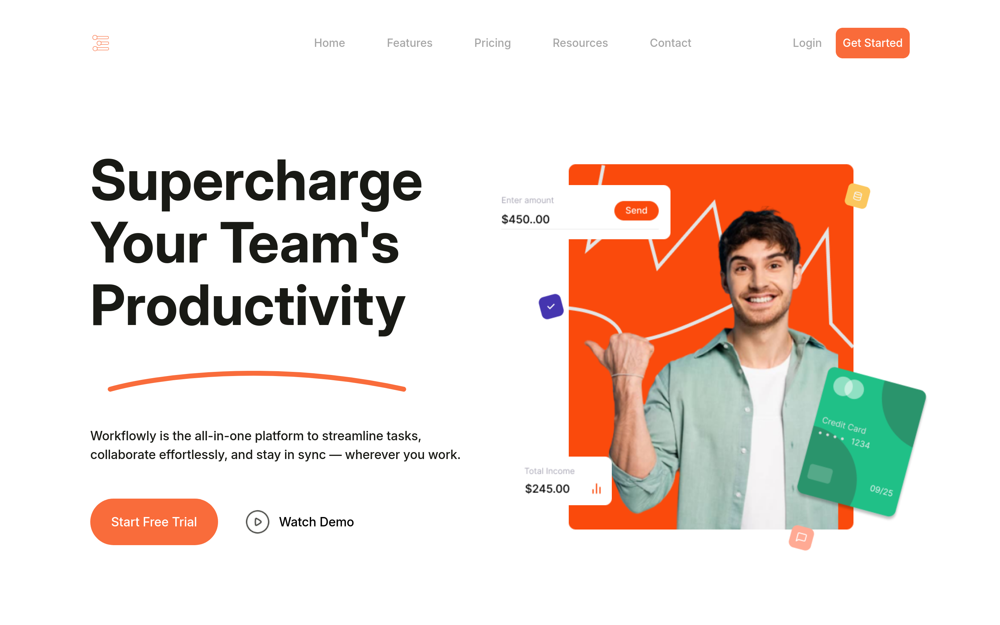

# Workflowly – Modern SaaS Landing Page

A sleek, responsive landing page built from a Figma design for a fictional SaaS product named Workflowly. This project showcases a clean UI, modular CSS architecture, and accessibility best practices—ideal for portfolio use or as a boilerplate for future marketing websites.

## Features

- Pixel-perfect layout from Figma
- Responsive design with flexible spacing and typography
- Custom CSS variables for theming
- Semantic HTML with accessible navigation
- Scalable code structure for future expansion
